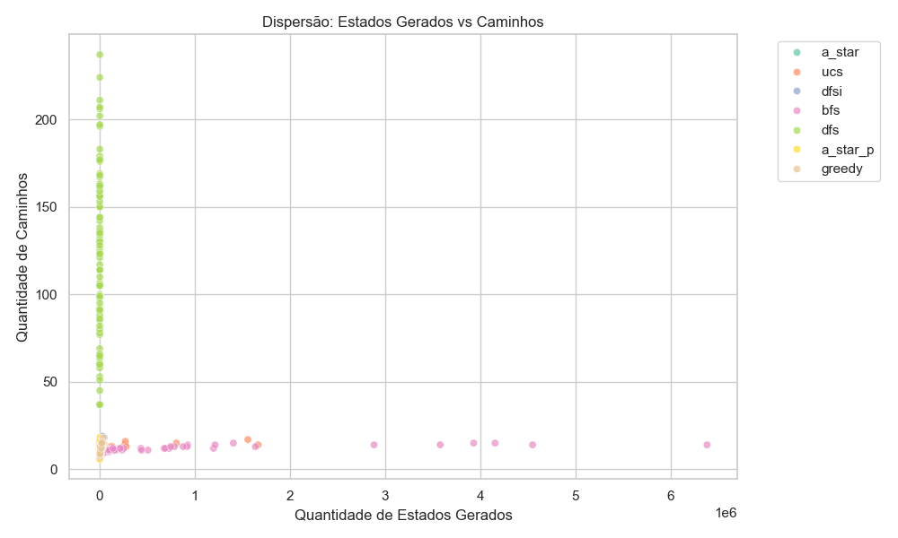
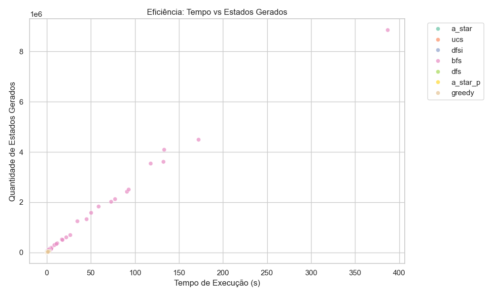
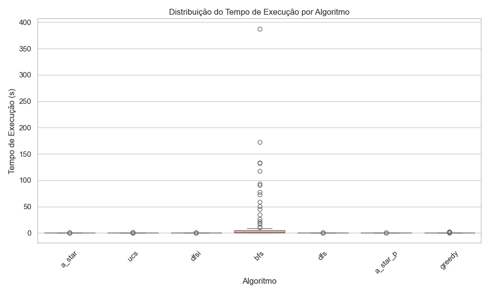
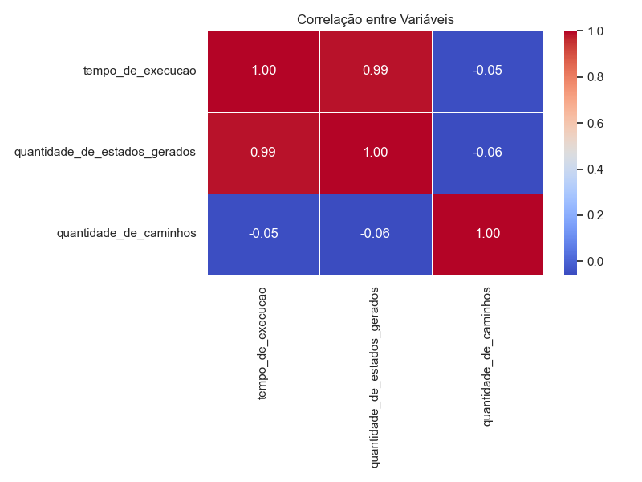
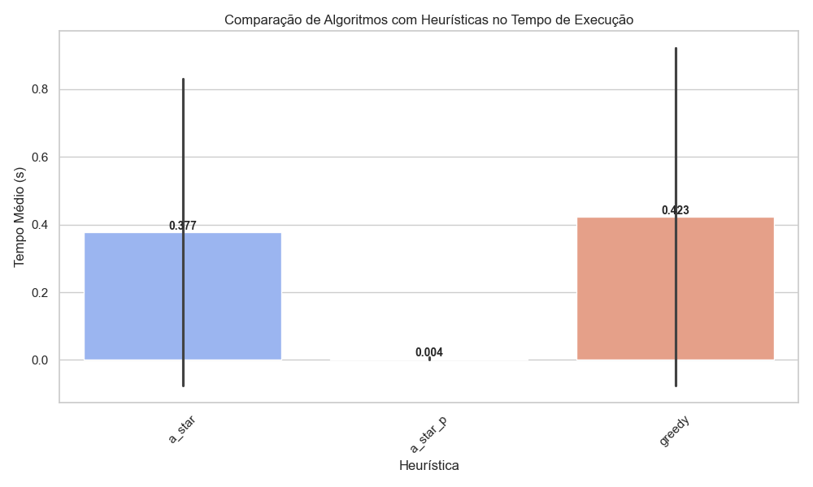
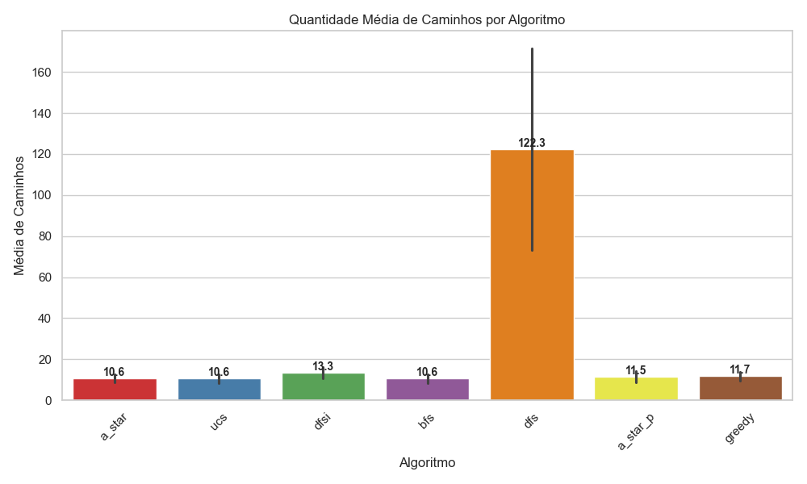

# Métodos de Busca Heurística para Jogos de Solitário de Um Jogador

### Projeto a ser desenvolvido para a unidade curricular de Inteligência Artificial da FEUP.

**Jogo de inspiração escolhido: Bird Sort.**

**Algoritmos a serem implementados: sem conhecimento (busca em largura, busca em profundidade, aprofundamento iterativo, custo uniforme) e com heurística (busca gulosa, algoritmo A*, A* Ponderado).

# Explicação dos Algoritmos de Busca para o Bird Sort

## Visão Geral
A classe `Algoritmo` implementa sete métodos de busca para resolver o jogo tipo Bird Sort:
1. **BFS (Busca em Largura)**
2. **DFS (Busca em Profundidade)**
3. **Busca em Profundidade Iterativa**
4. **Busca de Custo Uniforme (UCS)**
5. **A*** - Busca informada ótima
6. **A* Ponderado** - Versão balanceada do A*
7. **Busca Gulosa** - Busca puramente heurística

Cada algoritmo tem características distintas na forma de explorar o espaço de estados do jogo.

## 1. BFS (Busca em Largura)

### Funcionamento
- Utiliza uma **fila (FIFO)** para explorar todos os nós de um nível antes de avançar para o próximo
- Explora o tabuleiro em camadas de profundidade crescente
- Garante encontrar a solução com menor número de movimentos (ótima para custos uniformes)

### Características
- **Completo**: Sempre encontra solução se existir
- **Ótimo**: Para problemas com custo constante por movimento
- **Complexidade**: O(b^d) em espaço e tempo (b = fator de ramificação, d = profundidade da solução)

### Aplicação
- Ideal quando todos os movimentos têm igual importância
- Gera a solução com menos movimentos totais

## 2. DFS (Busca em Profundidade)

### Funcionamento
- Utiliza uma **pilha (LIFO)** para explorar um ramo até o fim antes de retroceder
- Pode ser limitado por profundidade máxima
- Não garante solução ótima (pode encontrar caminhos mais longos primeiro)

### Características
- **Não completo**: Pode entrar em loops infinitos em espaços ilimitados
- **Não ótimo**: Pode encontrar soluções subótimas
- **Complexidade**: O(bm) em espaço (b = fator de ramificação, m = profundidade máxima)

### Aplicação 
- Útil quando a solução está em ramos profundos
- Requer menos memória que BFS para espaços grandes

## 3. Busca em Profundidade Iterativa

### Funcionamento
- Combina BFS e DFS executando DFS com limites de profundidade crescente
- Reinicia a busca incrementando o limite até encontrar a solução
- Mantém as vantagens de ambos: completude do BFS e eficiência em espaço do DFS

### Características
- **Completo**: Como BFS
- **Ótimo**: Para custo uniforme
- **Complexidade**: O(b^d) tempo, O(bd) espaço

### Aplicação
- Boa alternativa quando não se sabe a profundidade da solução
- Equilíbrio entre desempenho e consumo de memória

## 4. Busca de Custo Uniforme (UCS)

### Funcionamento
- **Algoritmo ótimo** que expande sempre o nó com menor custo acumulado
- **Diferença chave**: Usa custo **fixo por movimento** (1 unidade)
- Utiliza **fila de prioridade** para expandir sempre o nó com menor custo acumulado
- Versão generalizada do BFS que considera custos variáveis por movimento

### Características Atualizadas
| Propriedade | Descrição | 
|------------|-----------|
| **Completeza** | Garante encontrar solução se existir |
| **Otimalidade** | Encontra solução com menor número de movimentos |
| **Estratégia** | Equivalente ao BFS para custos uniformes |
| **Complexidade** | O(b^d) - Exponencial na profundidade da solução |

### Aplicação
- Produz soluções mais inteligentes que BFS/DFS
- Prioriza formação de grupos completos de pássaros
- Adequado quando diferentes movimentos têm importância estratégica distinta

## 5. Algoritmo A* 

### Funcionamento
- Combina **custo real do caminho (g(n))** com **estimativa heurística admissível (h(n))**
- Utiliza fila de prioridade ordenada por `f(n) = g(n) + h(n)`
- Implementa heurística especializada que mantém a admissibilidade

### Heurística Atualizada (`heuristica_prioriza_quase_prontos`)
1. **Identificação de Galhos Quase Completos**:
   - Detecta galhos com 3/4 pássaros iguais
   - Atribui custo mínimo = 1 movimento para completá-los

2. **Cálculo Conservador para Outros Galhos**:
   - Para galhos mistos: `número de pássaros - tamanho do maior grupo`
   - Exemplo: [4,4,1,3] → custo 2 (precisa mover 1 e 3)

3. **Garantia de Admissibilidade**:
   - Nunca superestima o custo real da solução ótima
   - Sempre ≤ número mínimo real de movimentos necessários

### Características-Chave
| Propriedade | Descrição |
|-------------|-----------|
| **Completeza** | Garante encontrar solução se existir |
| **Otimalidade** | Mantém garantia de solução ótima |
| **Eficiência** | Reduz estados explorados vs BFS |
| **Complexidade** | O(b^d), mas com fator de ramificação reduzido |

### Aplicação
- Solução ideal para configurações complexas do jogo
- Quando se necessita da solução com menor número de movimentos
- Problemas onde a heurística pode fornecer boa orientação

## 6. A* Ponderado (Weighted A*)

### Funcionamento
- Versão parametrizada do A* com peso na heurística
- Utiliza fórmula f(n) = g(n) + w × h(n) (w > 1)
- Implementa heurística modular simples para avaliação rápida

### Heurística Simplificada (`heuristica_modular_simples`)
1. **Contagem de Pássaros**: Total de pássaros no tabuleiro
2. **Fator de Dispersão**: Soma de tipos diferentes por galho
3. **Galhos Vazios**: Bonificação por espaços livres

### Características
- **Completo**: Garante encontrar solução se existir
- **Subótimo**: Encontra soluções mais rápidas (mas não necessariamente ótimas)
- **Ajustável**: Peso (w) controla balanceamento entre custo e heurística

### Aplicação
- Quando se busca soluções rápidas com qualidade razoável
- Problemas grandes onde A* tradicional é muito lento
- Como alternativa à busca gulosa quando se quer algum controle de qualidade

## 7. Busca Gulosa (Greedy Best-First)

### Funcionamento
- Considera apenas o valor heurístico (ignora custo do caminho)
- Utiliza **fila de prioridade** ordenada apenas por h(n)
- Implementa mesma heurística de liberação

### Características
- **Não Completo**: Pode falhar em encontrar solução existente
- **Não Ótimo**: Encontra soluções de qualidade variável
- **Eficiência**: Extremamente rápido em problemas simples

### Aplicação
- Análise inicial de problemas simples
- Quando velocidade é mais importante que qualidade da solução
- Como linha de base para comparação com outros algoritmos

## Comparação entre os Algoritmos

| Algoritmo       | Completo | Ótimo | Complexidade Espaço | Complexidade Tempo | Melhor Caso |
|-----------------|----------|-------|---------------------|-------------------|-------------|
| BFS            | Sim      | Sim*  | O(b^d)              | O(b^d)            | Poucos movimentos |
| DFS            | Não      | Não   | O(bm)               | O(b^m)            | Solução profunda |
| IDDFS          | Sim      | Sim*  | O(bd)               | O(b^d)            | Balanceado |
| UCS            | Sim      | Sim   | O(b^(1+C/ε))        | O(b^(1+C/ε))      | Custos variáveis |
| A*             | Sim      | Sim** | O(b^d)              | O(b^d)            | Problemas complexos |
| A* Ponderado   | Sim      | Não   | O(b^d)              | O(b^(d/w))        | Soluções rápidas |
| Busca Gulosa   | Não      | Não   | O(b^m)              | O(b^m)            | Testes rápidos |

Legenda:
- *Ótimo para problemas com custo uniforme
- **Quando a heurística é admissível
- b = fator de ramificação
- d = profundidade da solução ótima
- m = profundidade máxima da árvore
- C = custo da solução ótima
- ε = custo mínimo por ação
- w = peso da heurística (w > 1)

## Conclusão
A escolha do algoritmo depende dos requisitos:
 Para soluções com mínimo de movimentos
- **UCS**: Para soluções estratégicas com custos variáveis
- **DFS/IDDFS**: Quando a memória é limitada

A escolha do algoritmo ideal depende dos requisitos específicos do problema e dos recursos disponíveis:

- **BFS**: Melhor para soluções com mínimo absoluto de movimentos, garantindo o caminho mais curto em problemas com custo uniforme. Indicado quando a otimalidade é crucial e o espaço de estados é moderado.

- **UCS**: Ideal para soluções estratégicas com custos variáveis de movimento, priorizando ações mais significativas. Excelente quando diferentes movimentos têm pesos distintos na estratégia de solução.

- **DFS/IDDFS**: Mais adequados quando a memória é limitada ou quando se suspeita que a solução está em níveis mais profundos da árvore de busca. O IDDFS oferece bom equilíbrio entre completude e uso de memória.

- **A***: A melhor opção para problemas complexos onde uma boa heurística está disponível, combinando eficiência com garantia de solução ótima quando a heurística é admissível.

- **A* Ponderado**: Recomendado quando se necessita de soluções rápidas com qualidade razoável, especialmente em problemas grandes onde o A* tradicional seria muito lento.

- **Busca Gulosa**: Útil para análises preliminares rápidas ou quando o tempo de resposta é crítico, mas a qualidade da solução é secundária.

Cada algoritmo apresenta vantagens específicas, e a escolha final deve considerar o trade-off entre:
✔️ Qualidade da solução (otimalidade)
✔️ Velocidade de processamento
✔️ Consumo de memória
✔️ Complexidade de implementação

# Análise de Heurísticas para o Bird Sort

Embora a heurística heurística_modular_simples apresente um resultado melhor em comparação com outras heurísticas, ela, ainda assim, não é ótima, ou seja, a heurística é não admissível (em algum momento superestima o custo real para alcançar o objetivo).

## 🔍 Heurística de Priorização de Grupos
**Método:** `heuristica_prioriza_quase_prontos()`  
**Algoritmo:** A* clássico

### 🎯 Objetivo Principal
Fornecer estimativas **conservadoras** que:
1. Priorizam galhos quase completos (3/4)
2. **Garantem admissibilidade** (nunca superestimam o custo real)
3. Mantêm a otimalidade do A*

### 📊 Métrica de Avaliação / Estratégia de Cálculo
```python
def heuristica_prioriza_quase_prontos(self, estado):
    ...
        # Caso 2: Galho 3/4 (custo mínimo = 1)
        if (galho, passaros[0]) in grupos_3_4:
            custo_estimado += 1
            
        # Caso 3: Galhos mistos
        else:
            tipo_maioritario = max(set(passaros), key=passaros.count)
            custo_estimado += len([p for p in passaros if p != tipo_maioritario])
    ...
```
### ✔️ Vantagens
- Foco estratégico em completar grupos
- Eficaz para soluções ótimas
- Precisão em jogos complexos

### ❌ Limitações
- Custo computacional elevado
- Implementação mais complexa

## 📐 Heurística Modular Simples
**Método:** `heuristica_modular_simples()`  
**Algoritmo:** A* Ponderado 

### 📈 Fórmula Básica
```python
def heuristica_simples(estado):
    total_passaros = sum(len(p) for p in estado.values())
    diversidade = sum(len(set(p)) for p in estado.values())
    vazios = sum(1 for p in estado.values() if not p)
    
    return total_passaros + diversidade - vazios
```

## 🧩 Heurística de Liberação
**Método:** `calcular_heuristica_liberacao()`  
**Algoritmo:** Busca Gulosa

### 🔧 Mecânica Principal
```python
def calcular_liberacao(estado):
    pontos = 0
    # Penaliza congestionamento
    for galho, passaros in estado.items():
        if len(passaros) > 2 and len(set(passaros)) > 1:
            pontos += 10 * len(passaros)
            
    # Bonifica mobilidade
    pontos -= calcular_movimentos_possiveis(estado) * 20
    
    return pontos
```

## 📌 Tabela Comparativa Completa
| Heurística       | Complexidade | Melhor Caso de Uso | Custo Computacional |
|------------------|--------------|--------------------|---------------------|
| Priorização Grupos | Alta | Finais de jogo | Alto |
| Modular Simples    | Baixa | Análise inicial | Muito Baixo |
| Liberação | Média | Situações de bloqueio | Moderado |

# Análise Comparativa: BFS vs A* em um Problema de Rearranjo de Galhos

## Estado Inicial do Tabuleiro

Galho 1: [4, 4, 1, 3]
Galho 2: [4, 4, 3, 3]
Galho 3: [2, 2, 3, 1]
Galho 4: [1, 1, 2, 2]
Galho 5: []
Galho 6: []

## 1. Busca em Largura (BFS)

### Características
- **Estratégia**: Explora todos os movimentos possíveis em camadas
- **Garantia**: Encontra solução com menor número de movimentos
- **Desempenho**: Ineficiente (explora muitos estados)

### Passos Típicos
1. Move topo de qualquer galho para galhos vazios/válidos
   - Ex: `1→5` (move 3), `2→5` (move 3), `3→5` (move 1)
2. Não prioriza movimentos estratégicos

### Solução Encontrada (Exemplo)
```python
1→5 (3), 2→5 (3), 2→5 (4), 3→1 (1), 3→5 (2), 
4→3 (2), 4→3 (1), 1→4 (4), 1→4 (4), 1→2 (1), 1→2 (4)
```

Total: 11 movimentos

Estados explorados: aproximadamente 420000

## 2. Algoritmo A* com Heurística

- **Heurística admissível:**
```python
def heuristica(estado):
    custo = 0
    for galho, passaros in estado.items():
        if not passaros or passaros == 'X': continue
        if len(set(passaros)) > 1:
            passaro_mais_comum = max(set(passaros), key=passaros.count)
            custo += len([p for p in passaros if p != passaro_mais_comum])
    return custo
```

### Características
- **Estratégia**: prioriza movimentos que:Completam galhos quase prontos (3/4) e reduzem dispersão de pássaros.
- **Garantia**: ótimo se heurística for admissível
- **Desempenho**: h(n) inicial: 8 (2 movimentos mínimos por galho misto)
- **Prioridade**: reduzir dispersão primeiro

### Passos Típicos
1. Move topo de qualquer galho para galhos vazios/válidos
   - Ex: `1→5` (move 3), `2→5` (move 3), `3→5` (move 1)
2. Não prioriza movimentos estratégicos

### Solução Encontrada (Exemplo)
```python
3→5 (1), 3→6 (2), 4→3 (2), 4→3 (1), 1→6 (3),
2→6 (3), 2→6 (4), 1→4 (4), 5→4 (1), 1→2 (4), 1→2 (4)
```

Total: 11 movimentos

Estados explorados: aproximadamente 2400

# Resultados e Análise de Desempenho dos Algoritmos

## Gráficos e Interpretações

### 1. Dispersão: Estados Gerados vs Caminhos
  
**O que mostra**:  
- Relação entre quantidade de estados explorados e caminhos para o resultado
- BFS demonstra ser menos eficiente por precisar explorar mais estados
- DFS tem menos estados gerados, mas o caminho do resultado apresenta ser maior
- A* Ponderado aparece mais concentrado (mais consistente)

---

### 2. Eficiência: Tempo vs Estados Gerados
  
**Insights**:  
- Correlação clara: mais estados = mais tempo de execução  
- BFS/UCS seguindo para o canto superior direito (piores desempenhos)  
- Os outros algoritmos estão mais presentes no canto inferior esquerdo (melhor eficiência)

---

### 3. Distribuição do Tempo de Execução
  
**Destaques**:  
- BFS/UCS com maior variação e outliers extremos  
- Heurísticas (A*/Greedy) com distribuição mais compacta  

---

### 4. Correlação entre Variáveis
  
**Principais correlações**:  
- Tempo e Estados Gerados: 0.99 (forte)  

---

### 5. Comparação de Algoritmos com Heurísticas no Tempo de Execução
  
**Resultados**:  
1. A* Ponderado: mais rápido (0.004s médio)  
2. A*: intermediário (0.377s)  
3. Greedy: intermediário (0.423s)

---

### 6. Tempo Médio por Algoritmo
  
**Ranking**:  
- Piores: BFS (~15s) e UCS (~1.5s)  
- Melhores: DFS (0.007s) e A* Ponderado (0.004s)  

---

### 7. Caminhos Médios Explorados
  
**Observações**:  
- DFS explora mais caminhos (média alta)  

## Conclusões Gerais
✅ **A* Ponderado** apresenta melhor equilíbrio entre tempo e qualidade  
⚠️ **Greedy** pode ser rápido, mas menos consistente  
⏳ **BFS/UCS** garantem otimalidade com alto custo computacional  
⚡ **DFS/DFSi** são rápidos, mas arriscados para problemas complexos


# Instruções de Execução do Bird Sort Game

## 📋 Pré-requisitos

### Para Windows e Linux
- [Python 3.8+](https://www.python.org/downloads/)
- [Pip](https://pip.pypa.io/en/stable/installation/) (normalmente vem com Python)
- [Git](https://git-scm.com/downloads) (opcional, mas recomendado)

## 🛠️ Instalação

### 1. Clonar o repositório
```bash
git clone https://github.com/douglasojesus/bird-sort-game.git
cd bird-sort-game
```

### 2. Criar ambiente virtual (recomendado)
- No windows:
```bash
python -m venv venv
venv\Scripts\activate
```
- No linux:
```bash
python -m venv venv
source venv/bin/activate
```

### 3. Instalar dependências
```bash
pip install -r requirements.txt
```

### 4. 🚀 Execução
```bash
python main.py
```
